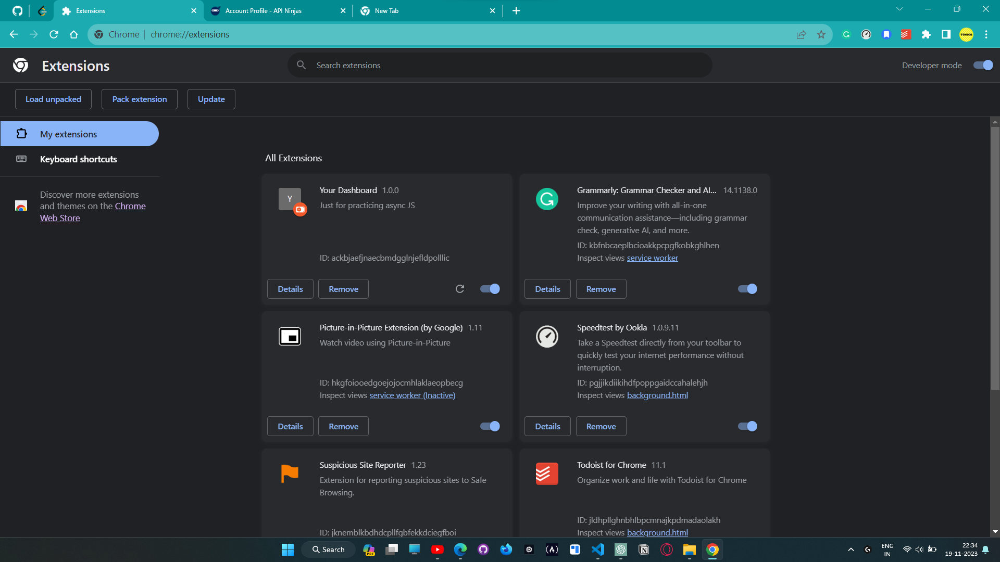

# Your Dashboard Chrome Extension




Welcome to the "Your Dashboard" Chrome extension repository! This Chrome extension is designed to provide you with a customizable dashboard right in your browser's new tab. You can add your favorite websites, view the current weather, and even set a daily quote to inspire you.

## Features

- **Customizable Dashboard**: Add your favorite websites for quick access.
- **Weather Display**: View the current weather conditions and temperature.
- **Daily Quote**: Set an inspiring quote to motivate you daily.
- **Search Bar**: Easily search the web using the integrated search bar.

## Installation

1. **Clone the Repository**
   ```
   git clone https://github.com/t3nsor98/Your-dashboard-Chrome-extension.git
   ```

2. **Open Chrome**
   - Navigate to `chrome://extensions/` in your Chrome browser.

3. **Enable Developer Mode**
   - Toggle on the "Developer mode" switch located at the top-right corner.

4. **Load the Extension**
   - Click on the "Load unpacked" button.
   - Select the `Your-dashboard-Chrome-extension` folder from your local file system.

## Usage

Once the extension is installed, open a new tab in Chrome to see your custom dashboard. You can add or remove websites, change the weather location, and update the daily quote by clicking on the settings icon or right-clicking on the dashboard.

## Contributing

We welcome contributions! If you have any ideas for new features or improvements, feel free to open an issue or submit a pull request.

## License

This project is licensed under the MIT License. See the `LICENSE` file for details.

## Support

For any questions or support, please [open an issue](https://github.com/t3nsor98/Your-dashboard-Chrome-extension/issues) on GitHub.

---

Thank you for using the "Your Dashboard" Chrome extension! We hope it enhances your browsing experience.
